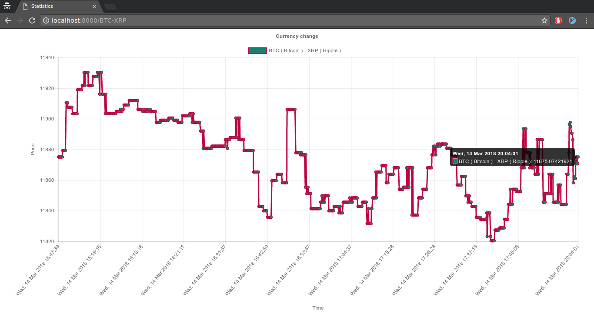

# Cryptocurrency stats

## Overview
Webapp monitoring(update - each 10 seconds) some pair of currencies you add to it. Supports **1560** known cryptocurrencies.

## How to run
First things first:

`
pip3 install -r requirements.txt
`

Starting the Celery Worker and the Beat:

`
 celery -A crypto worker -l info -B
`

Webapp itself:

`
python3 manage.py runserver 80
`

## Technologies used
* Django  2.0.3
* Celery 4.0.2
* Redis 2.10.6
* Bootstrap 4.0.0
* Chart.js 2.7.2

## Screenshots

